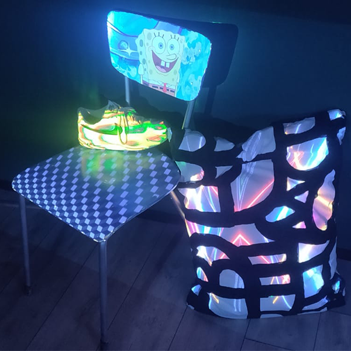

# Unity Projection Mapping Tool

This repository contains a Build and the Unity Project of the Projection Mapping Tool.

The tool is made for quick and simple projection mapping. 

Watch the tool in action: <https://youtu.be/XKlW0mNwSbg>

Additional explenation of the tool: <https://stefan.cherit.nl/projection-mapping-tool/>

## Functionality
* Custom Image and Video import
* Perspective warp 
* Add mask to cutoff content
* Fullscreen mode

## Extra Controls
Almost everything can be controlled by mouse.
* Mouse scroll-wheel: Make pencil bigger/smaller

## Version
The project is made with Unity 2019.3.5f1

The Build is only tested on Windows 10. 

## Owner
Project Made by Stefan Volkers

* Website: <https://stefan.cherit.nl/>
* Instagram: <https://www.instagram.com/stefandeveloper/>
